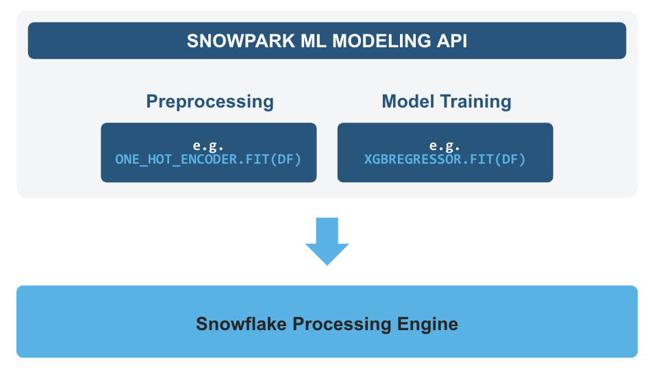

# Predicting Ad Spend ROI with Snowpark ML

Through this demo, you'll be able to showcase going from raw data to deploying an ML model that can help organizations optimize their advertising budget allocation.

Here is a summary of each step within this demo:

- **Data Engineering**: Leverage Snowpark for Python DataFrames in Snowflake Notebook to perform data transformations such as group by, aggregate, pivot, and join to prep the data for downstream applications
- **Data Pipelines**: Use Snowflake Tasks to turn your data pipeline code into operational pipelines with integrated monitoring
- **Machine Learning**: Process data and run training job in Snowflake Notebook using the Snowpark ML library, and register ML model and use it for inference from Snowflake Model Registry

### What is Snowpark?

Snowpark is the set of libraries and code execution environments that run Python and other programming languages next to your data in Snowflake. Snowpark can be used to build data pipelines, ML models, apps, and other data processing tasks.

**Client Side Libraries** - Snowpark libraries can be installed and downloaded from any client-side notebook or IDE and are used for code development and deployment. Libraries include the Snowpark API for data pipelines and apps and the Snowpark ML API for end to end machine learning.

**Elastic Compute Runtimes** - Snowpark provides elastic compute runtimes for secure execution of your code in Snowflake. Runtime options include: Python, Java, and Scala in warehouses, container runtimes for out-of-the-box distributed processing with CPUs or GPUs using any Python framework, or custom runtimes brought in from Snowpark Container Services to execute any language of choice with CPU or GPU compute.

Learn more about [Snowpark](https://www.snowflake.com/snowpark/).

### What is Snowflake ML?

Snowflake ML is the integrated set of capabilities for end-to-end machine learning in a single platform on top of your governed data. Snowflake ML can be used for fully custom and out-of-the-box workflows. For ready-to-use ML, analysts can use ML Functions to shorten development time or democratize ML across your organization with SQL from Studio, our no-code user interface. For custom ML, data scientists and ML engineers can easily and securely develop and productionize scalable features and models without any data movement, silos or governance tradeoffs.

To get started with Snowflake ML, developers can use the Python APIs from the [Snowpark ML library](https://docs.snowflake.com/en/developer-guide/snowpark-ml/index), directly from Snowflake Notebooks (public preview) or downloaded and installed into any IDE of choice, including Jupyter or Hex.

This demo will focus on:
- **Snowpark ML Modeling API**, which enables the use of popular Python ML frameworks, such as scikit-learn and XGBoost, for feature engineering and model training without the need to move data out of Snowflake.
- **Snowflake Model Registry**, which provides scalable and secure model management of ML models in Snowflake, regardless of origin.
Using these features, you can build and operationalize a complete ML workflow, taking advantage of Snowflake's scale and security features.

**Feature Engineering and Preprocessing** - Improve performance and scalability with distributed execution for common scikit-learn preprocessing functions.

**Model Training** - Accelerate model training for scikit-learn, XGBoost and LightGBM models without the need to manually create stored procedures or user-defined functions (UDFs), and leverage distributed hyperparameter optimization.

**Model Management and Batch Inference** - Manage several types of ML models created both within and outside Snowflake and execute batch inference.

### Key highlights in this demo

- Analyze data and perform data engineering tasks using Snowpark DataFrames and APIs
- Use open-source Python libraries from curated Snowflake Anaconda channel
- Create Snowflake Tasks to automate data pipelines
- Train ML model using Snowpark ML in Snowflake
- Register ML model and use it for inference from Snowpark ML Model Registry

## Access Notebook

**1)** Navigate to Snowsight by clicking on below button.

**2)** Change role to **{{ DATAOPS_CATALOG_SOLUTION_PREFIX }}_DATA_SCIENTIST** Role.

**3)** Find and click on the created Notebook named **{{ DATAOPS_CATALOG_SOLUTION_PREFIX}}_Predicting_Ad_Spend_ROI_with_Snowpark_ML** to explore.

{{ snowsight_button() }}